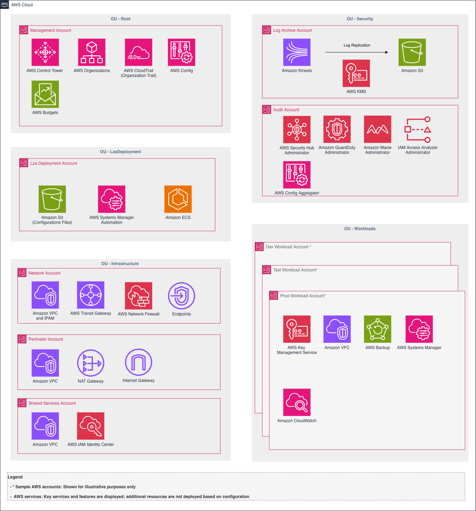
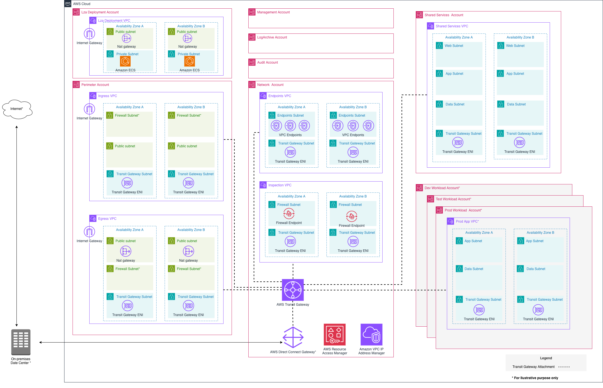

[#european-sovereign-cloud]
= AWS European Sovereign Cloud

== Introduction

This guidance is relevant for European public sector organizations and customers in highly regulated industries managing workloads subject to European data sovereignty, data residency, and operational autonomy requirements. It may be applicable to government agencies, financial institutions, healthcare organizations, telecommunications providers, or other entities required to keep data and operations within the European Union. It provides recommendations for deploying the LZA Universal Configuration in the link:https://aws.eu/[AWS European Sovereign Cloud], addressing service availability differences and partition-specific considerations.

The European Sovereign Cloud guidance builds upon the Universal Configuration baseline with targeted modifications to accommodate services and features not yet available in the AWS European Sovereign Cloud partition.

== Target Audience

* European public sector organizations with data sovereignty requirements
* Financial services, healthcare, and telecommunications providers operating under EU regulatory frameworks
* Organizations required to maintain data residency and operational control within the EU
* Cloud architects deploying AWS infrastructure in the AWS European Sovereign Cloud

== LZA Universal Configuration for AWS European Sovereign Cloud

=== Overview

The LZA Universal Configuration for the link:https://aws.eu/[AWS European Sovereign Cloud] is a pre-configured landing zone adapted for the AWS European Sovereign Cloud partition. It accounts for service availability differences and partition-specific considerations so you don't have to discover them during deployment.

The configuration uses the base hub and spoke network topology and provides the same architecture and security controls as the standard Universal Configuration.

=== Architecture

[NOTE]
While the LZA Universal Configuration implements AWS security best practices, customers are responsible for determining whether the configuration meets their specific regulatory and compliance requirements.

=== Service Availability

Certain AWS services and features used in the standard Universal Configuration are not available in the AWS European Sovereign Cloud. The configuration has these pre-configured to be excluded or adapted:

* AWS Control Tower controls
* AWS IAM Identity Center
* Amazon Macie
* AWS Cost and Usage Reports / AWS Budgets
* Resource Control Policies (RCPs)
* Declarative Policies
* Tagging Policies
* Backup Policies (AWS Organizations)
* Route 53 DNS Firewall managed domain lists
* Amazon Bedrock AgentCore VPC endpoints
* VPC Endpoints: `ec2messages`, `ssm-incidents`
* AWS Config Rules:
** _IAM_
*** `IAM_GROUP_HAS_USERS_CHECK`
*** `IAM_USER_GROUP_MEMBERSHIP_CHECK`
*** `IAM_NO_INLINE_POLICY_CHECK`
** _EC2 / EBS_
*** `EBS_OPTIMIZED_INSTANCE`
*** `EC2_INSTANCE_PROFILE_ATTACHED`
** _Backup_
*** `EBS_IN_BACKUP_PLAN`
*** `RDS_IN_BACKUP_PLAN`
*** `EC2_RESOURCES_PROTECTED_BY_BACKUP_PLAN`
*** `AURORA_RESOURCES_PROTECTED_BY_BACKUP_PLAN`
*** `BACKUP_PLAN_MIN_FREQUENCY_AND_MIN_RETENTION_CHECK`
*** `BACKUP_RECOVERY_POINT_ENCRYPTED`
*** `BACKUP_RECOVERY_POINT_MANUAL_DELETION_DISABLED`
** _CloudTrail_
*** `CLOUDTRAIL_SECURITY_TRAIL_ENABLED`
*** `CLOUDTRAIL_S3_DATAEVENTS_ENABLED`
** _Security Services_
*** `GUARDDUTY_NON_ARCHIVED_FINDINGS`
*** `SECURITYHUB_ENABLED`
*** `ACCOUNT_PART_OF_ORGANIZATIONS`
*** `EMR_KERBEROS_ENABLED`
*** `DYNAMODB_THROUGHPUT_LIMIT_CHECK`
** _Encryption / Secrets_
*** `SECRETSMANAGER_USING_CMK`
*** `SAGEMAKER_ENDPOINT_CONFIGURATION_KMS_KEY_CONFIGURED`
*** `SAGEMAKER_NOTEBOOK_INSTANCE_KMS_KEY_CONFIGURED`
*** `CODEBUILD_PROJECT_ARTIFACT_ENCRYPTION`
*** `API_GW_CACHE_ENABLED_AND_ENCRYPTED`
* AWS Config Remediation (`AWS::Config::RemediationConfiguration`)

[NOTE]
Not all AWS services are available in all Regions, including the AWS European Sovereign Cloud. Refer to the link:https://aws.amazon.com/about-aws/global-infrastructure/regional-product-services/[AWS Regional Services list] for current service availability.

=== Configuration Selection

Use the LZA Universal Configuration for AWS European Sovereign Cloud deployments:

link:https://github.com/aws/lza-universal-configuration/releases[`lza-universal-config-for-european-sovereign-cloud`]

This configuration is optimized for the AWS European Sovereign Cloud Region.

=== Architecture Diagram

The following diagram shows the AWS European Sovereign Cloud architecture with account types, services, and network connections:

[NOTE]
- AWS Network Firewall is used for north-south and east-west traffic inspection.
- Internet Gateway (IGW) is provided for both ingress and egress VPCs. Update these based on your requirements in Post-Deployment Considerations.
- The LZA Deployment account contains a dedicated VPC used exclusively for running the Amazon ECS container tasks that orchestrate LZA deployments. This VPC is not a shared services VPC for workloads. Keep this VPC isolated from your workload networks to separate deployment infrastructure from application environments. If you use an existing VPC, ensure it has appropriate network segmentation and security controls to protect the ECS deployment tasks.

== Customization for AWS European Sovereign Cloud

=== Configuration Updates

When deploying the LZA Universal Configuration for AWS European Sovereign Cloud environments, evaluate and update the following configuration settings based on your requirements:

* Set AWS European Sovereign Cloud regions as home and enabled regions (default: `eusc-de-east-1`)
* Configure log retention periods to meet your data retention requirements
* Update network settings for your specific CIDR ranges and connectivity requirements
* Review SCP and security controls for alignment with your organization's policies

=== Additional Controls for Consideration

* *SCP for Authorized Services*: Restrict access to only authorized AWS services based on your organization's security and compliance policies
* *No Internet Access Considerations*: For architectures requiring isolated environments, configure VPC endpoints and private connectivity without internet gateway access
* *Encryption Key Management*: Ensure KMS keys are provisioned within the AWS European Sovereign Cloud partition for all encryption requirements

== Deployment

=== Prerequisites

To deploy the LZA Universal Configuration in the AWS European Sovereign Cloud, verify the following:

* You have access to an AWS European Sovereign Cloud account
* You have an AWS Organization set up in the AWS European Sovereign Cloud partition
* You are authorized to create accounts in the AWS European Sovereign Cloud partition

=== Deploy LZA

The AWS European Sovereign Cloud uses the container deployment method for LZA. Follow the link:https://github.com/awslabs/landing-zone-accelerator-on-aws/tree/release/v1.15.4/container[LZA Container Deployment Guide] for detailed instructions on each step below.

1. Log in to the AWS European Sovereign Cloud Management account
2. Set up AWS Organizations
3. Create a dedicated LZA Deployment account
4. Configure required IAM roles in both the Management account and LZA Deployment account
5. Deploy LZA from the LZA Deployment account using the container method

Once complete, the environment is ready for customization.

=== Apply LZA Universal Configuration for AWS European Sovereign Cloud

==== Download and Extract Configuration Files

1. Download the `lza-universal-config-for-european-sovereign-cloud` zip file from the latest link:https://github.com/aws/lza-universal-configuration/releases[release]
2. Unzip the configuration files
3. The folder contains `config` and `docs` directories. The `config` directory contains the reference architecture to deploy.

==== Prepare Configuration Files

1. Download your local configuration files from the LZA configuration Amazon S3 bucket. Refer to link:https://docs.aws.amazon.com/solutions/latest/landing-zone-accelerator-on-aws/step-3.-update-the-configuration-files.html[Update the configuration files] for details on locating your configuration repository.
  * Log in to the LZA Deployment account
  * Navigate to the S3 bucket: `{AcceleratorQualifier}-config-{Account-ID}-{Region}`
  * Download `lza/aws-accelerator-config.zip`
2. Unzip your environment-specific configuration files
3. Copy the contents from the LZA Universal Configuration `config` folder into your local configuration. This overwrites existing files such as `accounts-config.yaml`.

==== Mandatory Configuration Updates

You need to update and verify the following key configuration files:

===== accounts-config.yaml

Verify and update email addresses specific to your environment:

[source,yaml]
----
mandatoryAccounts:
  - name: Management
    description: The management (primary) account
    email: <management>@example.com  # <----- UPDATE EMAIL ADDRESS
    organizationalUnit: Root
  - name: LogArchive
    description: The log archive account
    email: <log-archive>@example.com  # <----- UPDATE EMAIL ADDRESS
    organizationalUnit: Security
  - name: Audit
    description: The security audit account
    email: <audit>@example.com  # <----- UPDATE EMAIL ADDRESS
    organizationalUnit: Security

workloadAccounts:
  - name: LzaDeploymentAccount
    description: Account to access and manage Landing Zone Accelerator on AWS
    email: <lzadeployment>@example.com  # <----- UPDATE EMAIL ADDRESS
    organizationalUnit: LzaDeployment
  - name: SharedServices
    description: The SharedServices account
    email: <shared-services>@example.com  # <----- UPDATE EMAIL ADDRESS
    organizationalUnit: Infrastructure
  - name: Network
    description: The Network account
    email: <network>@example.com  # <----- UPDATE EMAIL ADDRESS
    organizationalUnit: Infrastructure
  - name: Perimeter
    description: The Perimeter account
    email: <perimeter>@example.com  # <----- UPDATE EMAIL ADDRESS
    organizationalUnit: Infrastructure

accountIds:
  - email: <lzadeployment>@example.com  # <----- UPDATE EMAIL ADDRESS
    accountId: '111111111111'  # <----- UPDATE ACCOUNT ID
----

===== replacements-config.yaml

Update the home region and enabled regions for your deployment:

[source,yaml]
----
globalReplacements:
  - key: HomeRegion
    type: String
    value: eusc-de-east-1  # <----- UPDATE TO YOUR HOME REGION
  - key: EnabledRegions
    type: StringList
    value:
      - "eusc-de-east-1"  # <----- UPDATE TO INCLUDE HOME REGION + ADDITIONAL REGIONS
  - key: AcceleratorQualifier
    type: String
    value: lza1  # <----- UPDATE TO MATCH AcceleratorQualifier in the installer stack

  # SNS email notification configuration
  - key: SecurityHigh
    type: String
    value: <notify-high>@example.com  # <----- UPDATE EMAIL ADDRESS
  - key: SecurityMedium
    type: String
    value: <notify-medium>@example.com  # <----- UPDATE EMAIL ADDRESS
  - key: SecurityLow
    type: String
    value: <notify-low>@example.com  # <----- UPDATE EMAIL ADDRESS
----

==== Deploy Configuration

1. Upload the updated configuration zip to the Amazon S3 configuration bucket (`{AcceleratorQualifier}-config-{Account-ID}-{Region}`)
2. Trigger the deployment through AWS Systems Manager automation (`RunEngine`)
3. Monitor the execution through AWS Systems Manager and Amazon CloudWatch Logs

== Post-Deployment Considerations

After deploying LZA and the Universal Configuration for the AWS European Sovereign Cloud, the foundational infrastructure is in place, but additional configuration and applications are required to meet your specific requirements. Evaluate your environment and add configurations or deploy applications based on your compliance and operational needs.

== Additional Resources

* link:https://aws.eu/[AWS European Sovereign Cloud]
* link:https://aws.amazon.com/solutions/implementations/landing-zone-accelerator-on-aws[Landing Zone Accelerator on AWS]
* link:https://github.com/awslabs/landing-zone-accelerator-on-aws/tree/release/v1.15.4/container[LZA Container Deployment Guide]
* link:https://aws.amazon.com/about-aws/global-infrastructure/regional-product-services[AWS Regional Services]

'''

link:../index.adoc[Back to Region and Industry Guidance]
